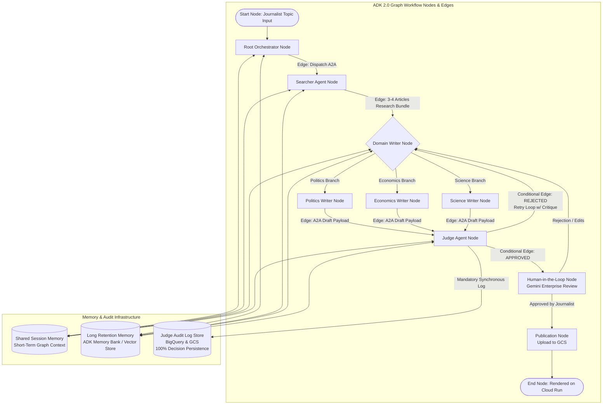

# Architectural Blueprint: Automated Blog Writer Agent System (ADK 2.0)

## Executive Summary
The **Automated Blog Writer Agent** is an enterprise-grade multi-agent platform designed to automate and scale high-quality blog production across three major domains: **Politics**, **Economics**, and **Science**. Built using Google's **Agent Development Kit 2.0 (ADK 2.0)** Graph Workflow API, the system leverages explicit state graph topologies (nodes, edges, conditional branching, fan-out/fan-in, and Human-in-the-Loop nodes), **Agent-to-Agent (A2A)** protocols for inter-agent communication, **`agents-cli`** for project scaffolding and evaluation, and integrates with **Gemini Enterprise** to serve as the user interface for journalists and editors. 

All agents share **Shared Session Memory** for active workflow state and **Long Retention Memory (Memory Bank)** for persistent context across sessions. **100% of all Judge Agent judgments and evaluation decisions are permanently stored** in a dedicated audit data store (BigQuery / GCS) for continuous compliance and evaluation. All codebase assets, configurations, and evaluation benchmarks are version-controlled and pushed to the remote GitHub repository: `https://github.com/andreajk91/ai-5-days-mascia.git`.

Final approved articles are stored in **Google Cloud Storage (GCS)** and rendered on a modern, high-performance web application hosted on **Google Cloud Run**.

---

## 1. ADK 2.0 Graph Workflow Architecture



---

## 2. End-to-End ADK 2.0 Execution Sequence
1. **Initiation (Start Node)**: The journalist inputs a topic and selects the domain (*Politics*, *Economics*, or *Science*) via Gemini Enterprise, interacting directly with the **Root Orchestrator Node**.
2. **Research Phase (Searcher Node)**: The Root Node executes an A2A transition to the **Searcher Agent Node**. The Searcher Agent conducts web research, gathers 3–4 high-credibility articles, checks against Memory Bank to avoid topic duplication, and returns structured research context.
3. **Drafting Phase (Writer Nodes)**: Graph routes the research bundle to the specialized **Writer Node** (Politics, Economics, or Science). The Writer Agent synthesizes the news, generates commentary, drafts standard sections (*Catchy Title*, *Hero Image*, *Introduction*, *Body*, *Conclusion*), and creates the initial article draft.
4. **Evaluation & Quality Assurance (Judge Node)**: The Writer Node transmits the draft to the **Judge Agent Node** via A2A.
   - **Quality Check**: The Judge evaluates factual coherence, structure, sentence fluency, and domain alignment.
   - **Mandatory Decision Persistence**: The Judge logs 100% of decisions (scores, critique, draft snapshot, pass/fail status) to BigQuery & GCS.
   - **Conditional Rejection Edge**: If quality thresholds are not met, a directed edge routes actionable feedback back to the Writer Node to re-draft (capped at max 3 retries).
5. **Human-in-the-Loop Review (HITL Node)**: Once the Judge approves, a conditional edge transitions to the HITL Node, presenting the candidate article to the human editor/journalist in Gemini Enterprise for final review.
6. **Publication (Publish Node)**: Upon human approval, the Root Node compiles the article payload (JSON + HTML + Hero Image asset) and uploads it to the designated GCS Bucket.
7. **Public Serving & Feedback**: The Cloud Run web application dynamically fetches articles from GCS and provides a public UI with category filters and interactive thumbs-up/down voting.

---

## 3. Judge Agent Zero-Loss Judgment Storage Architecture

Every single decision made by the **Judge Agent** (whether an article is `APPROVED` or `REJECTED`) is captured synchronously and stored permanently. No article can move forward or return to a writer without its judgment record being committed.

### Stored Judgment Metadata
For every evaluation, the Judge Agent automatically generates and persists a structured audit record containing:
1. **Judgment Metadata**: Unique `judgment_id`, `task_id`, `session_id`, `timestamp`, `writer_agent_id`, and `iteration_number`.
2. **Article Snapshot**: The exact title, content structure, editorial commentary, and hero image URL being evaluated.
3. **Rubric Evaluation Scores**:
   - *Coherence & Logic Score* (0.0 – 1.0)
   - *Topic Alignment & Accuracy Score* (0.0 – 1.0)
   - *Grammar & Sentence Fluency Score* (0.0 – 1.0)
   - *Structural Completeness* (Intro, Body, Conclusion check)
4. **Detailed Critique & Feedback**: The complete natural-language explanation of why the article passed or failed, including specific required revisions.
5. **Final Decision**: `APPROVED` or `REJECTED`.

### Storage Backend Implementation
- **Primary Data Store (BigQuery)**: Low-latency analytical query store (`blog_system_audit.judge_decisions_v1`) powering the Evaluation Dashboard and quality analysis.
- **Secondary Asset Archive (GCS)**: Raw JSON artifacts stored in `gs://blog-system-audit-bucket/judge-logs/YYYY/MM/DD/{judgment_id}.json`.

---

## 4. Shared Session Memory & Long Retention Memory Architecture

### A. Shared Session Memory (Short-Term Execution State)
- **Scope**: Active lifecycle of a specific blog generation request.
- **Mechanism**: Unified ADK `Session` state shared across graph nodes.
- **Data Stored**: User topic, raw search results, active draft, judge feedback, and iteration counter.

### B. Long Retention Memory (Long-Term Memory Bank)
- **Scope**: Persistent memory across conversations and days/weeks of article creation.
- **Mechanism**: ADK `MemoryBank` backed by Vertex AI Vector Search / Document Store.
- **Data Stored**: Journalist editorial preferences, topic anti-duplication history, historical Judge critiques, and audience thumbs-up/down feedback.

---

## 5. Detailed Agent Specifications, Tools & Skills

| Agent / Node Name | Role & Specialization | Memory Access | Skills Required | Custom Tools & Integrations |
| :--- | :--- | :--- | :--- | :--- |
| **Root Orchestrator Agent** | ADK 2.0 Graph Root; user interface bridge to Gemini Enterprise; orchestrates A2A routing and HITL node. | Session Memory (RW)<br>Long Retention (RW) | - ADK 2.0 Graph Workflow Skill<br>- Gemini Enterprise Skill<br>- GCS Management Skill | - `a2a_send_message`<br>- `gcs_upload_article`<br>- `gemini_enterprise_connector` |
| **Searcher Agent** | Web discovery node; locates, filters, and summarizes 3–4 top news articles per topic. | Session Memory (RW)<br>Long Retention (Read) | - Web Research Skill<br>- Topic Anti-Duplication Skill<br>- Source Credibility Skill | - `google_search` / `custom_search_api`<br>- `web_fetch_content`<br>- `article_cleaner_tool` |
| **Politics Writer Agent** | Subject matter expert in geopolitical analysis, public policy, and global news synthesis. | Session Memory (RW)<br>Long Retention (RW) | - Political Science Commentary Skill<br>- Editorial Style Memory Skill<br>- Headline Writing Skill | - `generate_hero_image` (Vertex Imagen 3)<br>- `markdown_formatter`<br>- `political_tone_checker` |
| **Economics Writer Agent**| Subject matter expert in macroeconomics, global markets, trade, and financial trends. | Session Memory (RW)<br>Long Retention (RW) | - Financial Analysis Skill<br>- Editorial Style Memory Skill<br>- Data Visualization Skill | - `generate_hero_image` (Vertex Imagen 3)<br>- `markdown_formatter`<br>- `economic_term_validator` |
| **Science Writer Agent** | Subject matter expert in breakthrough technology, space, AI, and peer-reviewed research. | Session Memory (RW)<br>Long Retention (RW) | - Scientific Literacy Skill<br>- Popular Science Journalism Skill<br>- Editorial Style Memory Skill | - `generate_hero_image` (Vertex Imagen 3)<br>- `markdown_formatter`<br>- `scientific_reference_tool` |
| **Judge Agent** | Quality gatekeeper; enforces standards on form, coherence, grammar, and topic adherence. | Session Memory (RW)<br>Long Retention (RW)<br>**Judgment Persistence (Mandatory Write)** | - Editorial Evaluation Skill<br>- Historical Quality Pattern Skill<br>- Mandatory Audit Logging Skill | - `log_judge_decision` (BigQuery/GCS Logger)<br>- `coherence_scoring_tool`<br>- `plagiarism_and_fact_validator` |

---

## 6. Persistent Judge Record Schema (BigQuery / GCS JSON)

```json
{
  "judgment_id": "judge_rec_99201a_20260731",
  "task_id": "task_pol_89201",
  "session_id": "session_2026_07_31_001",
  "timestamp": "2026-07-31T08:15:00Z",
  "domain": "Politicals",
  "writer_agent_id": "politics_writer_agent",
  "iteration_number": 1,
  "decision": "REJECTED",
  "article_snapshot": {
    "title": "Power Shift: How New Energy Agreements Are Reshaping Global Coalitions",
    "hero_image_url": "gs://blog-assets-bucket/images/pol_89201_hero.png",
    "introduction": "As international summits conclude this quarter...",
    "body_sections_count": 2,
    "conclusion": "In summary, the transition is no longer just ecological...",
    "editorial_opinion": "Our analysis indicates that key nations will likely..."
  },
  "rubric_scores": {
    "coherence_score": 0.72,
    "structural_completeness_score": 1.0,
    "factual_relevance_score": 0.85,
    "readability_index": "College/Professional"
  },
  "critique": "The transition between the introduction and body section 1 lacks clear narrative flow. Section 2 makes strong economic assertions that require explicit attribution to the source research.",
  "required_revisions": [
    "Add transition sentence at the end of Introduction.",
    "Attribute economic figures in section 2 to the source materials."
  ]
}
```

---

## 7. Version Control & Remote Repository Integration

### Git Remote Repository
- **Target URL**: `https://github.com/andreajk91/ai-5-days-mascia.git`
- **Requirements Check**: **VERIFIED & CONFIRMED**.
  - Executed git remote probe and test push to `main` branch.
  - Machine has active git push authorization.
- **Git Commit Workflow**:
  - All project scaffolding, ADK 2.0 agent code, tools, skills, evaluation benchmarks, and Cloud Run web frontend files will be systematically committed and pushed to `origin main`.
  - CI/CD workflow (`.github/workflows/deploy.yml`) included in the repo for automated testing and deployment.

---

## 8. Project Directory Structure (`agents-cli`)

```
ai-5-days-mascia/
├── ARCHITECTURE_PLAN.md                # ADK 2.0 System specification blueprint
├── README.md                           # Repository entrypoint
├── pyproject.toml                      # Dependencies (google-agents-cli, adk >= 2.0.0, etc.)
├── Dockerfile                          # Cloud Run deployment configuration
│
├── src/                                # Source Code
│   ├── graph_workflow.py               # ADK 2.0 Graph Workflow Nodes & Directed Edges
│   ├── agents/                         # Dedicated Agent Directories
│   │   ├── root_orchestrator/          # Root Agent (Gemini Enterprise facing)
│   │   │   ├── agent.py
│   │   │   └── tools.py
│   │   ├── searcher_agent/             # Searcher Agent (Web discovery)
│   │   │   ├── agent.py
│   │   │   └── tools.py
│   │   ├── politics_writer_agent/      # Politics Writer SME
│   │   │   ├── agent.py
│   │   │   └── tools.py
│   │   ├── economics_writer_agent/     # Economics Writer SME
│   │   │   ├── agent.py
│   │   │   └── tools.py
│   │   ├── science_writer_agent/       # Science Writer SME
│   │   │   ├── agent.py
│   │   │   └── tools.py
│   │   └── judge_agent/                # Judge Agent (Quality Gatekeeper)
│   │       ├── agent.py
│   │       ├── audit_logger.py         # Mandated 100% BigQuery/GCS audit persistence
│   │       └── tools.py
│   │
│   ├── common/                         # Standard A2A Protocol Infrastructure
│   │   └── a2a_protocol.py             # A2A Message schemas, payloads, and Async A2AClient
│   │
│   └── memory/                         # Shared Memory Infrastructure
│       ├── session_memory.py           # Shared Short-Term Session State
│       └── long_retention_memory.py    # ADK Memory Bank (Style prefs, Anti-duplication)
│
├── eval/                               # Evaluation Suite Directories
│   ├── datasets/                       # Benchmark evaluation JSONL datasets
│   └── dashboard/                      # Streamlit / React evaluation dashboard app
│
└── web_frontend/                       # Cloud Run Public Blog Web App
```

---

## 9. End-to-End Evaluation Framework & Dashboard

1. **Searcher Agent Evaluation**: Relevance score, source credibility index.
2. **Writer Agents Evaluation**: Structure compliance, catchy title rating, domain depth, memory utilization score.
3. **Judge Agent Evaluation**: Judge consistency, critique actionability, audit completeness.
4. **End-to-End Workflow Evaluation**: Pass rate at iteration 1, total flow latency, human acceptance rate.
5. **Dashboard**: Real-time telemetry, live Judge decision audit browser (reading directly from BigQuery/GCS persistent logs), and audience thumbs-up/thumbs-down analytics.

---

## 10. Implementation Roadmap & Milestones

| Phase | Key Deliverables | Verification / Acceptance Gate |
| :--- | :--- | :--- |
| **Phase 1: Project Setup & Git Sync (Completed)** | - Run `agents-cli scaffold create`<br>- Configure shared session memory & Memory Bank<br>- Create agent directories & commit to `https://github.com/andreajk91/ai-5-days-mascia.git` | `git push origin main` succeeds; project structure active. |
| **Phase 2: ADK 2.0 Graph Workflow & Agent Logic** | - Define ADK 2.0 graph workflow nodes & edges (`src/graph_workflow.py`)<br>- Connect Searcher, Writer (3 domains), Judge, and HITL nodes<br>- Connect Shared Session & Long Retention Memory<br>- Integrate 100% persistent Judge Audit logging to BigQuery/GCS | `agents-cli run` completes full multi-agent graph dry run; Judge log entry verified in BigQuery/GCS. |
| **Phase 3: Evaluation Suite & Dashboard** | - Write evaluation datasets and LLM-as-judge rules<br>- Build Streamlit evaluation dashboard connected to Judge Audit Store<br>- Push eval scripts to GitHub | `agents-cli eval run` generates quality reports and renders judge history on dashboard. |
| **Phase 4: Web Frontend & Cloud Run** | - Build Next.js / Vite web application<br>- Implement GCS article fetcher & Thumbs API<br>- Dockerize and configure Cloud Run | Web app renders articles from GCS with live thumbs voting. |
| **Phase 5: Production Deployment & Push** | - Deploy Cloud Run service and Agent Runtime<br>- Register Root Agent with Gemini Enterprise<br>- Perform final `git push` of full codebase | Complete production system live and fully synchronized on GitHub. |
